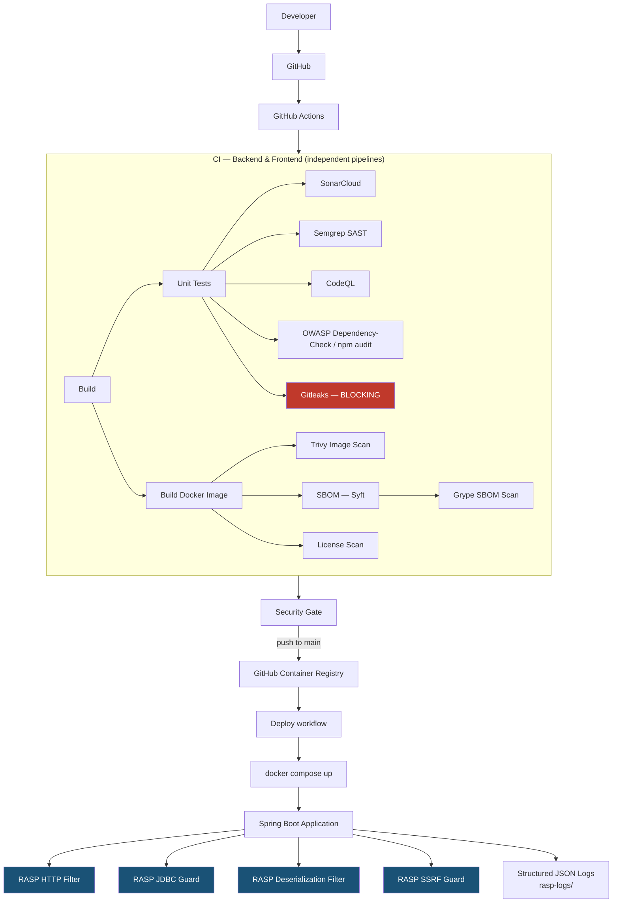
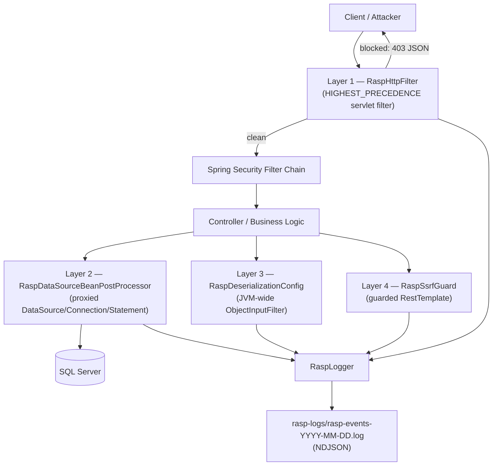

# Transport — DevSecOps Platform

Enterprise-grade CI/CD + DevSecOps pipeline, container security, supply-chain
security and Runtime Application Self-Protection (RASP) for the **Transport**
application (Spring Boot backend + Angular frontend), built as an
engineering final-year project (PFE).

This document is the single source of truth for the whole security
architecture: what runs, why, in what order, which secrets it needs, how to
reproduce it locally, how to fix it when it breaks, and how to prove the
runtime protection (RASP) actually works.

---

## 1. Repository layout

The application was already split into two independent GitHub repositories
before this work started:

| Repository | Contents | Remote |
|---|---|---|
| **Backend** | Spring Boot 4 / Java 17 API | `git@github.com:khawlaGuizani/Backend.git` |
| **Frontend** | Angular 21 SPA | `git@github.com:khawlaGuizani/Frontend.git` |
| **devsecops-platform** *(this repo)* | `docker-compose.yml`, deployment workflow, this document | push this folder as a new 3rd repo |

Each of Backend and Frontend has its **own, fully independent** CI/CD
pipeline (`.github/workflows/ci.yml` + `.github/workflows/codeql.yml`) that
builds, tests and scans that component on every push — this is standard
polyrepo/microservice practice and avoids forcing an artificial monorepo
merge onto two already-separate git histories.

This third repository exists purely for **orchestration**: it has nothing to
build or test itself, so it only carries `docker-compose.yml` (which builds
Backend and Frontend from `../backend` and `../frontend` — clone all three
side by side), an optional deployment workflow, and this documentation.

```
pfe-khawla/
├── backend/                     # Spring Boot API — repo "Backend"
│   ├── .github/workflows/ci.yml
│   ├── .github/workflows/codeql.yml
│   ├── security/{gitleaks.toml,semgrep.yml,dependency-check-suppressions.xml}
│   ├── sonar-project.properties
│   ├── Dockerfile
│   └── src/main/java/com/tn/gias/transport/rasp/   # RASP module
├── frontend/                    # Angular SPA — repo "Frontend"
│   ├── .github/workflows/ci.yml
│   ├── .github/workflows/codeql.yml
│   ├── security/{gitleaks.toml,semgrep.yml}
│   ├── sonar-project.properties
│   ├── Dockerfile
│   └── nginx.conf
└── devsecops-platform/          # this repo — orchestration only
    ├── docker-compose.yml
    ├── .env.example
    ├── .github/workflows/deploy.yml
    └── README-DEVSECOPS.md
```

---

## 2. Architecture



This implements all four DevSecOps pillars in one pipeline:

- **Shift-Left** — SAST (Semgrep, CodeQL), secret scanning (Gitleaks) and
  code quality (SonarCloud) run on every push/PR, before merge.
- **Supply-Chain Security** — dependency scanning (OWASP Dependency-Check,
  npm audit), SBOM generation (Syft) and SBOM vulnerability scanning
  (Grype).
- **Container Security** — Trivy scans the built Docker images for
  OS+library CVEs.
- **Runtime Security (RASP)** — the only layer active *after* deployment,
  protecting the running application itself. See [§8](#8-runtime-security-rasp).

---

## 3. Pipeline stages & execution order

### Backend (`backend/.github/workflows/ci.yml`)

| Order | Job | What it does | Blocking? |
|---|---|---|---|
| 1 | `build-test-sonar` | `./mvnw clean verify` (JUnit + JaCoCo), then SonarCloud analysis | Yes (build/tests) |
| 2 | `gitleaks` | Scans full git history for secrets | **Yes** |
| 3 | `dependency-check` | OWASP Dependency-Check against all Maven deps | Report-only (SARIF → Security tab) |
| 4 | `semgrep` | SAST across Java sources | Report-only |
| 5 | `license-scan` | Aggregates third-party license report | Report-only |
| 6 | `docker-image-security` | Builds the image, then Trivy + Syft + Grype | Fails only on CRITICAL CVE with a fix available |
| 7 | `security-gate` | Aggregates all job results; fails the run if build/tests or Gitleaks failed | Yes |

`backend/.github/workflows/codeql.yml` runs CodeQL (`java-kotlin`) on
push/PR and weekly on a schedule, independent of the main pipeline.

### Frontend (`frontend/.github/workflows/ci.yml`)

Same shape, Node/Angular equivalents: `npm ci` → `npm test` (Vitest, with
coverage + JUnit XML) → `npm run build` → SonarCloud → Gitleaks → `npm
audit` → Semgrep → `license-checker` → Docker build + Trivy/Syft/Grype →
security gate. `frontend/.github/workflows/codeql.yml` covers
`javascript-typescript`.

### Why this order

Gitleaks and the build/test job are the only **blocking** gates. Everything
else (dependency scanning, SAST, container scanning, license) uploads a
report as a workflow artifact **and** as a SARIF file to GitHub's
Security → Code scanning tab, but doesn't fail the build. This is a
deliberate, common professional trade-off: you want every push to surface
findings immediately (so they don't silently pile up), but you don't want a
single newly-disclosed transitive CVE with no available fix to block every
developer's work. Tighten `exit-code`/`fail-build` flags in the workflows if
you want a stricter gate for your defense.

---

## 4. Security tools — what and why

| Tool | Layer | Why this one | Config |
|---|---|---|---|
| **SonarCloud** | Code quality | Bugs, code smells, coverage, duplication in one dashboard; free for public repos | `sonar-project.properties` in each repo |
| **Gitleaks** | Secrets | Fast, regex+entropy based, scans full git history (catches secrets committed then "removed") | `security/gitleaks.toml` in each repo |
| **OWASP Dependency-Check** | Backend deps | Maps Maven dependencies to NVD CVEs; industry standard for Java supply chain | invoked directly via `mvn org.owasp:dependency-check-maven:check`, suppressions in `security/dependency-check-suppressions.xml` |
| **npm audit** | Frontend deps | Built into npm, zero extra setup, authoritative for the npm advisory database | `frontend/.github/workflows/ci.yml` |
| **Semgrep** | SAST | Fast, rule-based, supports custom rules per language (Java + TS/Angular here) alongside the OWASP Top 10 registry ruleset | `security/semgrep.yml` in each repo |
| **CodeQL** | SAST (deep/dataflow) | GitHub-native, deep taint-tracking SAST that complements Semgrep's pattern matching; free for public repos | `.github/workflows/codeql.yml` in each repo |
| **Trivy** | Container images | Scans OS packages + language deps inside the built image, not just the source tree | `docker-image-security` job in each `ci.yml` |
| **Syft** | SBOM | Generates a CycloneDX SBOM of the image — required for supply-chain provenance/compliance | `docker-image-security` job |
| **Grype** | SBOM scanning | Cross-references the Syft SBOM against vulnerability DBs — catches things a filesystem scan alone might miss | `docker-image-security` job |
| **license-checker / license-maven-plugin** | License compliance | Flags copyleft/incompatible licenses in dependencies before they become a legal problem | `license-scan` job |
| **Custom RASP module** | Runtime | See [§8](#8-runtime-security-rasp) | `backend/src/main/java/.../rasp/` |

---

## 5. GitHub Secrets required

Configure these under **Settings → Secrets and variables → Actions** in
**each** repository that needs them.

### Backend & Frontend (both repos)

| Secret | Required? | Used for | How to get it |
|---|---|---|---|
| `SONAR_TOKEN` | Optional (pipeline warns and skips Sonar if absent) | SonarCloud analysis | sonarcloud.io → import the repo → My Account → Security → Generate token |
| `GITHUB_TOKEN` | Built-in, no setup needed | SARIF upload, GHCR push | Provided automatically by GitHub Actions |
| `DISPATCH_TOKEN` | Required for auto-deploy | `security-gate`'s "Trigger deployment" step fires a `repository_dispatch` (`security-gate-passed`) to the `devsecops-platform` repo | Fine-grained PAT scoped to the `devsecops-platform` repo only, with **Contents: read and write** permission |

### Backend only

| Secret | Required? | Used for |
|---|---|---|
| `NVD_API_KEY` | Optional but strongly recommended | Speeds up OWASP Dependency-Check's NVD feed download drastically (unauthenticated requests are heavily rate-limited). Get one free at [nvd.nist.gov/developers/request-an-api-key](https://nvd.nist.gov/developers/request-an-api-key) |

### devsecops-platform (deploy workflow only — optional)

`deploy.yml` runs on a **self-hosted runner installed directly on the
target host** (vm1) — it is on a private LAN, unreachable from GitHub's
cloud-hosted runners, so no SSH secrets are needed at all; the runner pulls
jobs from GitHub instead of GitHub pushing to it. See `actions-runner/` on
the host and GitHub → this repo → Settings → Actions → Runners.

| Secret | Required? | Used for |
|---|---|---|
| `MSSQL_SA_PASSWORD` | If using `deploy.yml` | Written into the target host's `.env` for `docker compose` |
| `MAIL_USERNAME` / `MAIL_PASSWORD` | Optional | SMTP credentials, same as above |

### SonarCloud project keys used

The workflows are pre-configured for:
- Backend: `sonar.organization=khawlaguizani`, `sonar.projectKey=khawlaGuizani_Backend`
- Frontend: `sonar.organization=khawlaguizani`, `sonar.projectKey=khawlaGuizani_Frontend`

When you import each repo on sonarcloud.io it will generate matching keys
automatically in most cases; if yours differ, update `sonar-project.properties`
and the `-D` flags in the corresponding `ci.yml`.

### Container registry

Images are pushed to **GitHub Container Registry** (`ghcr.io`), not Docker
Hub — it needs zero extra secrets/signup, using the built-in
`GITHUB_TOKEN`. Images are pushed only on `push` to `main`/`master`, as
`ghcr.io/<owner>/backend` and `ghcr.io/<owner>/frontend`.

---

## 6. Running everything locally

### Backend

```bash
cd backend
./mvnw clean verify                     # build + tests + JaCoCo coverage
./mvnw org.owasp:dependency-check-maven:12.1.0:check \
  -Dformats=HTML -DassemblyAnalyzerEnabled=false      # dependency scan
docker run --rm -v "$PWD:/repo" zricethezav/gitleaks:latest \
  detect --source /repo --config /repo/security/gitleaks.toml -v
docker run --rm -v "$PWD:/src" semgrep/semgrep semgrep scan \
  --config /src/security/semgrep.yml --config p/java /src
docker build -t transport-backend:local .
```

### Frontend

```bash
cd frontend
npm ci
npm test                                # Vitest, coverage + JUnit XML
npm run build -- --configuration production
npm audit
docker build -t transport-frontend:local .
```

### Full stack (backend + frontend + SQL Server)

```bash
cd devsecops-platform
cp .env.example .env        # edit MSSQL_SA_PASSWORD at minimum
docker compose up -d --build
docker compose ps            # wait until all three are "healthy"
curl http://localhost:8080/actuator/health   # backend
curl http://localhost:8081/                  # frontend
```

Note: `spring.jpa.hibernate.ddl-auto=update` creates *tables*, not the
*database* — a fresh SQL Server container only has `master`. The
`db-init` one-shot service in `docker-compose.yml` runs
`CREATE DATABASE vanoiseee` before the backend's first connection attempt;
this was verified in practice (the backend fails fast with "Cannot open
database" otherwise) and is why that service exists.

Tear down: `docker compose down -v` (the `-v` also removes the SQL Server
data volume — drop it if you want to keep data between restarts).

---

## 7. Fixing common pipeline failures

| Symptom | Likely cause | Fix |
|---|---|---|
| `gitleaks` job fails the pipeline | A real secret (or something that looks like one) was committed | Rotate the credential immediately, remove it from the file, and if it was ever pushed, scrub it from git history (`git filter-repo` / BFG) — a local `git rm` alone does not remove it from history. If it's a false positive, add a scoped entry to `security/gitleaks.toml`'s `[allowlist]` with a comment explaining why |
| `build-test-sonar` fails with "SONAR_TOKEN" warning only | Secret not configured yet | Add `SONAR_TOKEN` (see §5) — the job doesn't hard-fail without it, it just skips analysis |
| `dependency-check` job is very slow (>20 min) | No `NVD_API_KEY`, so the NVD feed download is rate-limited | Add `NVD_API_KEY` (see §5); the workflow also caches the NVD DB between runs via `actions/cache` |
| `docker-image-security` fails on a CRITICAL CVE | A base image or dependency has a known, fixed vulnerability | Bump the affected dependency/base image tag; if genuinely a false positive or unfixable right now, document it — do not silently loosen `exit-code`/`severity` without a note explaining why |
| Backend container crash-loops with `SQLServerException: Login failed` | Wrong `DB_PASSWORD` / `MSSQL_SA_PASSWORD` mismatch, or SQL Server not ready yet | Confirm both env vars in `.env` are identical (the app connects as `sa`); `docker compose` already waits on `db: condition: service_healthy` before starting the backend |
| Backend container crash-loops with `Cannot open database "vanoiseee"` | The `db-init` service didn't run/complete | `docker compose logs db-init` — rerun `docker compose up -d db-init` manually if needed |
| `/actuator/health` reports `DOWN` for no obvious reason | An unrelated auto-configured health indicator (e.g. mail) is failing | This project already disables the mail indicator (`management.health.mail.enabled=false`) after hitting exactly this in testing — if you add new integrations (Redis, etc.), either provision them or disable their health indicator the same way |
| Frontend `npm test` fails with "coverage-v8 not found" | `@vitest/coverage-v8` version drifted from the installed `vitest` version | `npm ls vitest` then `npm install --save-dev @vitest/coverage-v8@<same version>` |
| Frontend Docker container exits immediately with `host not found in upstream "backend"` | `nginx.conf` used a static `proxy_pass http://backend:8080` instead of a resolved variable | Already fixed in this repo's `frontend/nginx.conf` via `resolver 127.0.0.11` + `set $backend_upstream` — only relevant if you hand-edit that file |
| `docker compose up` fails with "port is already allocated" | Another process on your machine already uses that host port | Set `BACKEND_PORT` / `FRONTEND_PORT` in `.env` to free ports (defaults are 8080/8081; the `db` service is intentionally not published to the host at all) |

---

## 8. Runtime Security (RASP)

### 8.1 What is RASP

**Runtime Application Self-Protection** is security instrumentation that
lives *inside* the running application process — not in front of it (like a
WAF) and not before deployment (like SAST/DAST). It has visibility into the
application's actual runtime state: the real SQL about to be executed, the
real file path about to be opened, the real class about to be
deserialized — so it can detect and block an attack exactly at the point
where it would otherwise cause damage, with far fewer false positives than
pattern-matching a raw HTTP request in isolation.

### 8.2 WAF vs RASP

| | WAF | RASP |
|---|---|---|
| Where it runs | Network edge, in front of the app | Inside the app process |
| Visibility | Raw HTTP request/response only | Application internals: SQL text, file I/O, deserialization, outbound calls |
| Blind spots | Anything not visible at the network layer (e.g. an attack assembled from otherwise-benign-looking parameters, then concatenated into SQL deep in the code) | None of the app's own logic — but no visibility into traffic that never reaches this specific app instance |
| Deployment | One WAF can front many apps | Deployed per-application, coupled to its runtime |
| False positives | Higher — decided from request shape alone | Lower — decided with actual application context |

This project implements both API-layer inspection (the RASP HTTP filter,
similar in spirit to what a WAF does) **and** deep hooks (JDBC, deserialization,
SSRF) that no WAF could ever provide — because a WAF cannot see the SQL
string Hibernate is about to execute or the Java class about to be
deserialized.

### 8.3 SAST vs DAST vs RASP

| | SAST | DAST | RASP |
|---|---|---|---|
| When | Before deployment, on source code | Before/after deployment, black-box against a running instance | **After** deployment, in production traffic |
| Finds | Patterns in code that *could* be vulnerable | Confirmed exploitable behavior via simulated attacks | Actual attack attempts, in real time, on real traffic |
| This project's tools | Semgrep, CodeQL | *(not implemented here — see Limitations)* | Custom RASP module |
| Complements Shift-Left by... | — | — | Catching what SAST/DAST structurally cannot: 0-days, logic flaws no static rule encodes, and dependency vulnerabilities that only become exploitable given a specific runtime input |

RASP is the last line of defense in a defense-in-depth strategy: even if a
vulnerability slips past SonarCloud, Semgrep, CodeQL and Dependency-Check
(all of which run *before* the code ever reaches production), RASP can still
catch the exploit attempt at the moment it's actually used against the live
application.

### 8.4 Why a custom module instead of OpenRASP

OpenRASP (Baidu) was evaluated and is the best-known open-source RASP for
Java. It was **not** used here because:

1. It requires shipping a pre-built, third-party native (`.so`) agent into
   the Docker image — a binary blob that cannot be audited as part of this
   project's own source.
2. The upstream project has seen essentially no releases since ~2022.
3. For a thesis deliverable, a from-scratch implementation that can be
   explained and defended line-by-line is more valuable than integrating an
   opaque third-party agent.

Instead, this project implements a **real, working, in-process RASP layer**
using only standard JDK/Spring mechanisms — no native code, no bytecode
weaving magic, fully readable Java:

| OpenRASP hook type | This project's equivalent |
|---|---|
| `sql` | `RaspDataSourceBeanPostProcessor` — JDK dynamic proxy around the `DataSource`/`Connection`/`Statement` chain |
| `ssrf` | `RaspSsrfGuard` + a guarded `RestTemplate` bean |
| `directory` / path traversal | `RaspHttpFilter` + `RaspGuard.checkPathTraversal` |
| `command` | `RaspHttpFilter` + `RaspGuard.checkCommand` |
| `transformer` (deserialization) | `RaspDeserializationConfig` — a JVM-wide `java.io.ObjectInputFilter` (JEP 290) |
| `xxe` | `RaspXmlUtils` hardened parser factories + `RaspGuard.checkXxe` |
| `ldap` | `RaspGuard.checkLdap` |
| `ognl`/expression injection | `RaspGuard.checkExpression` (SpEL/OGNL payload signatures) |
| `fileUpload` | `RaspFileUploadValidator` — extension blacklist + magic-byte sniffing |

### 8.5 Architecture — where RASP sits



Four independent layers, each able to block on its own — an attack that
somehow bypasses the HTTP filter (layer 1) is still caught by the JDBC guard
(layer 2) if it manifests as malicious SQL, by the deserialization filter
(layer 3) if it's a gadget-chain payload, or by the SSRF guard (layer 4) if
it's an outbound-call attack.

### 8.6 Configuration

All via `rasp.*` properties in `backend/src/main/resources/application.properties`,
overridable by environment variable (see `docker-compose.yml`):

| Property | Env var | Default | Meaning |
|---|---|---|---|
| `rasp.enabled` | `RASP_ENABLED` | `true` | Master switch — `false` makes every hook a no-op |
| `rasp.mode` | `RASP_MODE` | `block` | `block` rejects attacks (HTTP 403 / `InvalidClassException`); `detect` only logs ("shadow mode" — safe way to roll out new rules) |
| `rasp.log-dir` | `RASP_LOG_DIR` | `./rasp-logs` | Where structured JSON logs are written (mounted as a Docker volume in `docker-compose.yml`) |
| `rasp.ssrf.allowed-hosts` | `RASP_SSRF_ALLOWED_HOSTS` | *(empty)* | Comma-separated hostname allowlist for outbound calls |
| `rasp.demo.enabled` | `RASP_DEMO_ENABLED` | `false` | Enables `/api/rasp-demo/**` — see §9 below. **Never enable in a real deployment.** |

### 8.7 Advantages

- Catches attacks regardless of which upstream layer (SAST/dependency
  scan/WAF) they slipped past.
- Deep, app-specific visibility a WAF structurally cannot have (real SQL
  text, real deserialized class names).
- `detect` mode allows safe rollout of new rules without risking false-positive outages.
- Structured JSON logs are immediately ELK-ready (see §10).
- No third-party binary agent — 100% auditable source in this repo.

### 8.8 Limitations

- Pattern/heuristic-based detection (like most RASP and WAF products) can
  have false positives/negatives; it is a defense-in-depth layer, not a
  substitute for parameterized queries, input validation, and the Shift-Left
  scans that already run in CI.
- The JDBC guard adds a small per-query overhead (a JDK dynamic proxy hop);
  negligible for this application's traffic, but worth knowing.
- `/api/rasp-demo/**` contains deliberately vulnerable code paths (see §9) —
  it is disabled by default and must stay that way outside of a controlled
  demonstration.
- This is a from-scratch academic-grade implementation, not a
  battle-tested commercial RASP product — appropriate for this project's
  purpose, not a drop-in replacement for one in a real production system
  without further hardening and review.

---

## 9. Runtime Validation — demonstrating RASP live

Enable the demo endpoints (only on an isolated/local machine, never in a
real deployment):

```bash
cd devsecops-platform
# in .env: RASP_DEMO_ENABLED=true
docker compose up -d --build
```

Every request below was actually run against a live container during this
project's development (not just written on paper) — the recorded HTTP
status codes and log lines are what was observed.

### 9.1 SQL Injection

```bash
curl -G http://localhost:8080/api/rasp-demo/sql --data-urlencode "input=hello"
# → 200 {"result":"hello"}   (benign baseline)

curl -G http://localhost:8080/api/rasp-demo/sql --data-urlencode "input=' UNION SELECT 1--"
```
- **Expected request**: a UNION-based injection payload in the `input` query parameter.
- **Expected detection**: `RaspGuard.checkSql` matches the `union select` + comment-terminator signature (`RaspPatterns.SQL_INJECTION`) at the HTTP layer; if it somehow reached the JDBC layer, `RaspDataSourceInvocationHandler` would catch it again on `prepareStatement`/`createStatement`.
- **Expected blocking**: `HTTP 403`, body `{"error":"Forbidden","message":"Request blocked by RASP","attackType":"SQL_INJECTION","status":403}`.
- **Expected log** (`rasp-logs/rasp-events-*.log`): `{"layer":"HTTP","attackType":"SQL_INJECTION","severity":"CRITICAL","matchedRule":"sql-injection-signature","blocked":true,...}`.

### 9.2 Path Traversal

```bash
curl -G http://localhost:8080/api/rasp-demo/path --data-urlencode "filename=welcome.txt"
# → 200 (benign baseline, serves the sandboxed demo file)

curl -G http://localhost:8080/api/rasp-demo/path --data-urlencode "filename=../../../../etc/passwd"
```
- **Expected detection**: `RaspPatterns.PATH_TRAVERSAL` matches `../` sequences.
- **Expected blocking**: `HTTP 403`, `attackType":"PATH_TRAVERSAL"`.
- **Expected log**: `"layer":"HTTP","attackType":"PATH_TRAVERSAL","severity":"HIGH","matchedRule":"path-traversal-signature"`.

### 9.3 OS Command Injection

```bash
curl -G http://localhost:8080/api/rasp-demo/exec --data-urlencode "host=localhost; cat /etc/passwd"
```
- **Expected detection**: `RaspPatterns.COMMAND_INJECTION` matches the `;`/`cat` shell-metacharacter + dangerous-binary pattern.
- **Expected blocking**: `HTTP 403`, `attackType":"COMMAND_INJECTION"` — the `ProcessBuilder` call in the demo controller is never reached.
- **Expected log**: `"layer":"HTTP","attackType":"COMMAND_INJECTION","severity":"CRITICAL"`.

### 9.4 SSRF

```bash
curl -G http://localhost:8080/api/rasp-demo/ssrf --data-urlencode "url=http://169.254.169.254/latest/meta-data/"
```
- **Expected request**: a URL targeting the cloud metadata endpoint (or any RFC1918/loopback/link-local address).
- **Expected detection**: `RaspSsrfGuard.checkTarget` resolves the host and checks `InetAddress.isLinkLocalAddress()`/`isSiteLocalAddress()`/`isLoopbackAddress()`.
- **Expected blocking**: `HTTP 403`, `attackType":"SSRF"` — the outbound `RestTemplate` call never fires.
- **Expected log**: `"layer":"SSRF","attackType":"SSRF","matchedRule":"internal-address-blocked"`.

### 9.5 Expression Injection (SpEL/OGNL)

```bash
curl -G http://localhost:8080/api/rasp-demo/expr --data-urlencode "expression=T(java.lang.Runtime).getRuntime().exec('id')"
```
- **Expected detection**: `RaspPatterns.EXPRESSION_INJECTION` matches the `T(java.lang.Runtime)` SpEL RCE gadget signature.
- **Expected blocking**: `HTTP 403`, `attackType":"EXPRESSION_INJECTION"`.

### 9.6 Insecure Deserialization

```bash
# Any serialized Java object naming a class outside the JEP-290 allowlist
# (e.g. a well-known gadget-chain class) is rejected by the JVM-wide filter —
# this protects every ObjectInputStream in the process, not just this demo
# endpoint.
curl -X POST http://localhost:8080/api/rasp-demo/deserialize \
  -H "Content-Type: text/plain" --data-binary "<base64-encoded-payload>"
```
- **Expected detection**: the process-wide `ObjectInputFilter` installed by `RaspDeserializationConfig` returns `REJECTED` for blacklisted classes (`org.apache.commons.collections.functors.*`, `org.codehaus.groovy.runtime.**`, RMI remote objects, ...).
- **Expected blocking**: `HTTP 403`, `{"blocked":true,"reason":"RASP global ObjectInputFilter rejected this class",...}`.
- **Expected log**: `"layer":"DESERIALIZATION","attackType":"INSECURE_DESERIALIZATION","severity":"CRITICAL"`.

### 9.7 Dangerous File Upload

```bash
echo '<% Runtime.getRuntime().exec(request.getParameter("c")); %>' > shell.jsp
curl -F "file=@shell.jsp" http://localhost:8080/api/rasp-demo/upload
```
- **Expected detection**: `RaspFileUploadValidator`/`RaspGuard.checkFileName` matches the `.jsp` extension against `RaspPatterns.DANGEROUS_FILE_EXTENSION`.
- **Expected blocking**: `HTTP 403`, `attackType":"DANGEROUS_FILE_UPLOAD"`.

### 9.8 XXE

```bash
curl -X POST http://localhost:8080/api/rasp-demo/xxe -H "Content-Type: application/xml" --data-binary @- <<'EOF'
<?xml version="1.0"?>
<!DOCTYPE foo [<!ENTITY xxe SYSTEM "file:///etc/passwd">]>
<foo>&xxe;</foo>
EOF
```
- **Expected detection**: `RaspPatterns.XXE` matches `<!DOCTYPE ... SYSTEM` / `<!ENTITY`; even if it slipped through, `RaspXmlUtils`' hardened `DocumentBuilderFactory` (external entities disabled) would refuse to resolve it.
- **Expected blocking**: `HTTP 403`, `attackType":"XXE"`.

### 9.9 LDAP Injection

```bash
curl -G http://localhost:8080/api/rasp-demo/ldap --data-urlencode "filter=*)(uid=*))(|(uid=*"
```
- **Expected detection**: `RaspPatterns.LDAP_INJECTION` matches the filter-breakout pattern.
- **Expected blocking**: `HTTP 403`, `attackType":"LDAP_INJECTION"`.

---

## 10. Logging

RASP writes one **NDJSON** (newline-delimited JSON) line per detection event
to `rasp-logs/rasp-events-YYYY-MM-DD.log`, mounted as a named Docker volume
(`rasp-logs`) so logs survive container restarts. Example line:

```json
{"timestamp":"2026-07-28T10:59:53.816301369Z","layer":"HTTP","attackType":"PATH_TRAVERSAL","severity":"HIGH","sourceIp":"172.17.0.1","httpMethod":"GET","uri":"/api/rasp-demo/path","matchedRule":"path-traversal-signature","payloadSnippet":"filename=../../../../etc/passwd","blocked":true,"mode":"BLOCK","detail":null}
```

Each event is also mirrored to the standard application logger (`docker
logs`) at WARN (HIGH/CRITICAL) or INFO level, under the `RASP` logger name.

**No ELK stack is bundled with this project.** The NDJSON format was chosen
specifically so it's ELK-ready without modification: point a Filebeat
instance at the `rasp-logs` volume with a JSON codec and it will parse every
field directly — no Logstash grok pattern needed, just:

```yaml
filebeat.inputs:
  - type: filestream
    paths: [/path/to/rasp-logs/*.log]
    parsers:
      - ndjson:
          target: ""
          add_error_key: true
```

---

## 11. Deployment (optional)

`devsecops-platform/.github/workflows/deploy.yml` deploys the stack via a
**self-hosted GitHub Actions runner installed directly on the target host**
(vm1, `192.168.205.150`) — a private-LAN address unreachable from GitHub's
cloud-hosted runners, so a hosted-runner-over-SSH approach cannot work here.
The self-hosted runner pulls jobs from GitHub instead of GitHub pushing to
it, so no inbound network access, SSH keys, or open ports are needed.

The job checks out this repo on the runner (i.e. directly on vm1), writes
`.env` from GitHub Secrets, then runs `docker compose -f docker-compose.yml
pull backend frontend && docker compose -f docker-compose.yml up -d
--remove-orphans` — explicitly excluding `docker-compose.override.yml`
(present in the checkout since it's tracked in git, but only meant for
local dev builds — see §11a below) so it never gets auto-merged in.
Because `docker-compose.yml` itself has no `build:` sections, this can
never trigger a build.

To set up the runner on a new host: GitHub → this repo → Settings →
Actions → Runners → New self-hosted runner, follow the Linux x64
instructions, then install it as a systemd service so it survives reboots:
`sudo ./svc.sh install && sudo ./svc.sh start`.

Two ways it triggers:
1. Manual (`workflow_dispatch`) — a human checks that Backend/Frontend CI is
   green, then runs this workflow.
2. Automatic — each repo's `security-gate` job (in `ci.yml`) ends with a
   "Trigger deployment" step that fires a `repository_dispatch`
   (`security-gate-passed`) to this repo, using the `DISPATCH_TOKEN` secret
   (see §5). This means either Backend's or Frontend's Security Gate passing
   on `main` redeploys both — safe, since `docker compose pull` is
   idempotent and always pulls the current `:latest` of both images.

See §5 for the secrets `deploy.yml` needs on the target host.

### 11a. Local dev vs. production compose files

`docker-compose.yml` is intentionally image-only (`image: ${BACKEND_IMAGE}` /
`${FRONTEND_IMAGE}`, no `build:`), because it's the exact file copied to the
production server. For local development, `docker-compose.override.yml`
sits next to it and is auto-merged by Compose (no `-f` flags needed) — it
adds back `build: {context: ../backend|../frontend}` so `docker compose up
-d --build` behaves exactly as before. That override file stays out of the
deploy path on purpose.

---

## 12. Tooling summary

| Category | Tool |
|---|---|
| CI/CD | GitHub Actions |
| Code quality | SonarCloud |
| Secret scanning | Gitleaks |
| Backend dependency scanning | OWASP Dependency-Check |
| Frontend dependency scanning | npm audit |
| SAST | Semgrep, CodeQL |
| Container image scanning | Trivy |
| SBOM generation | Syft |
| SBOM vulnerability scanning | Grype |
| License compliance | license-maven-plugin, license-checker |
| Containers | Docker, Docker Compose |
| Container registry | GitHub Container Registry (ghcr.io) |
| Runtime protection | Custom RASP module (this project) |
